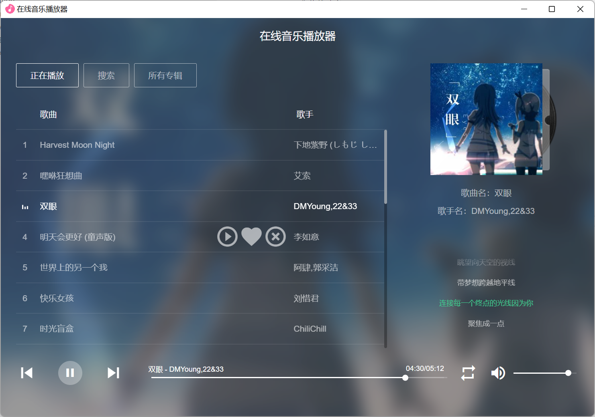
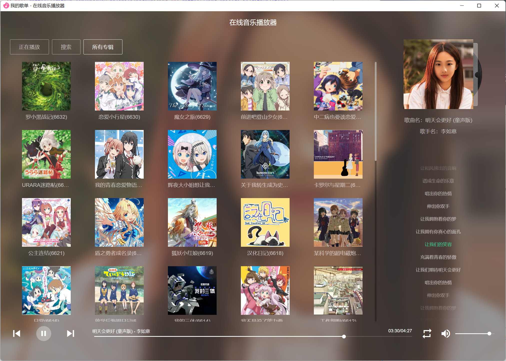
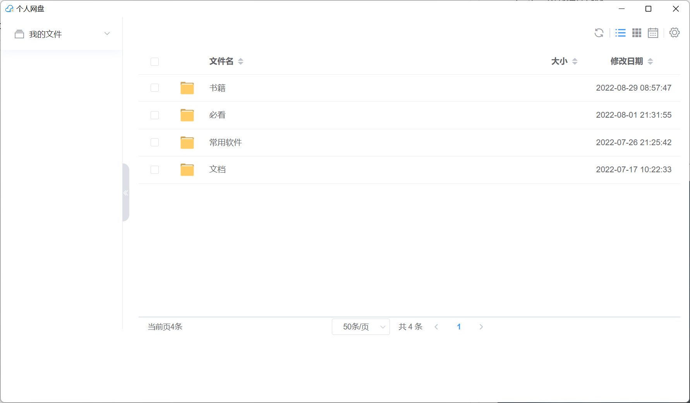
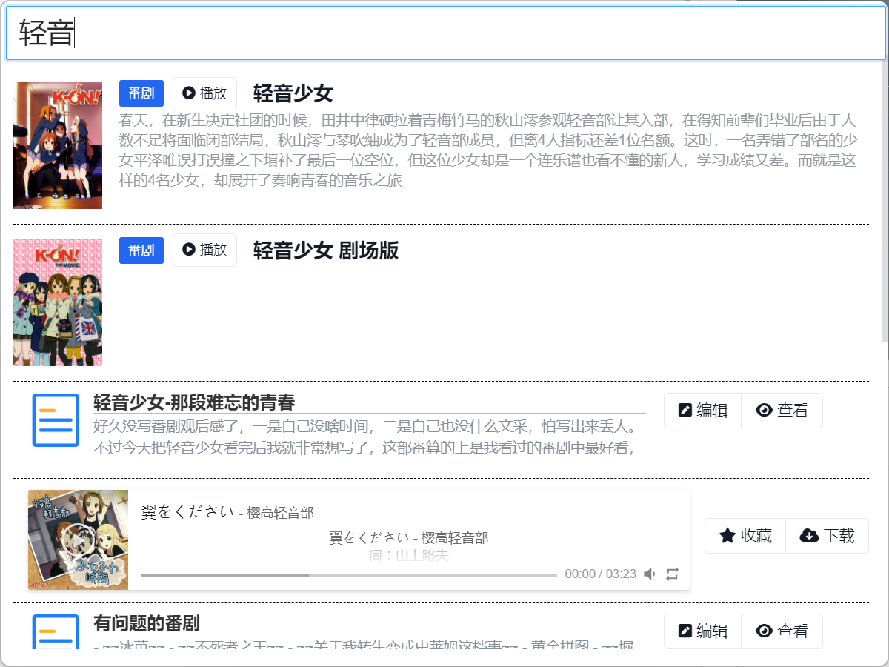
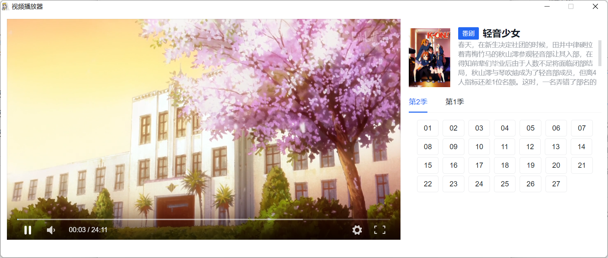
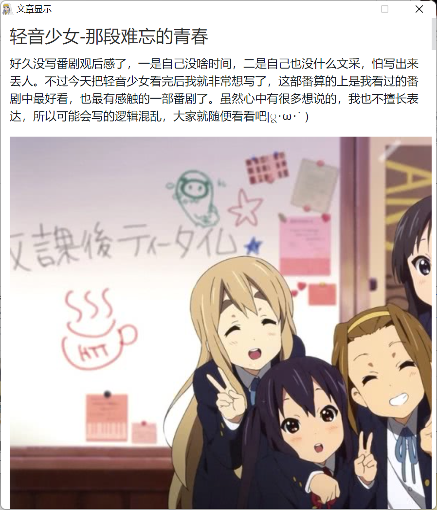
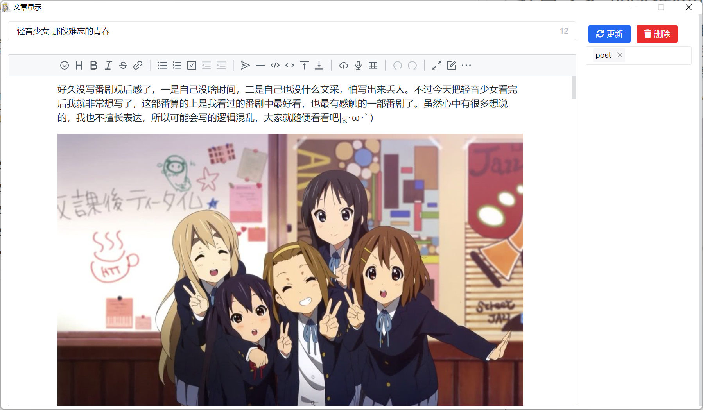
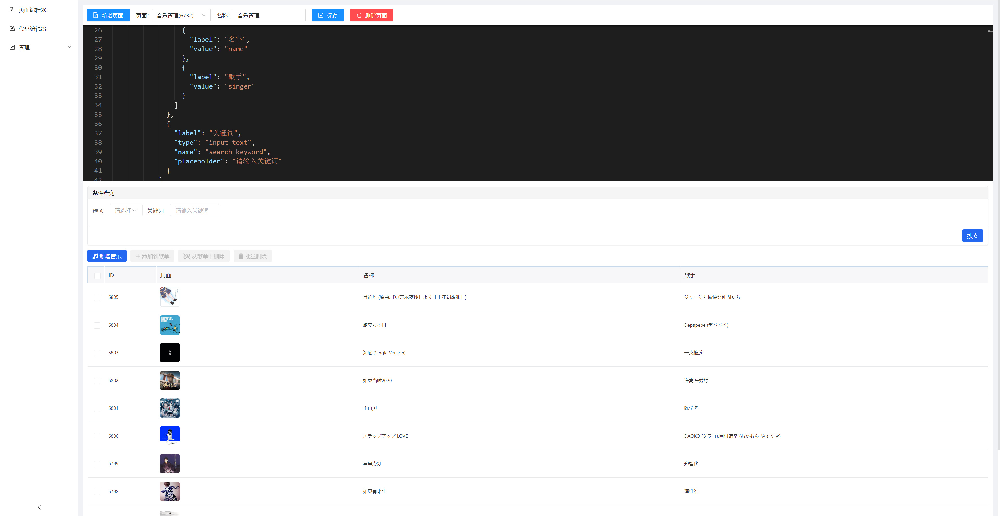
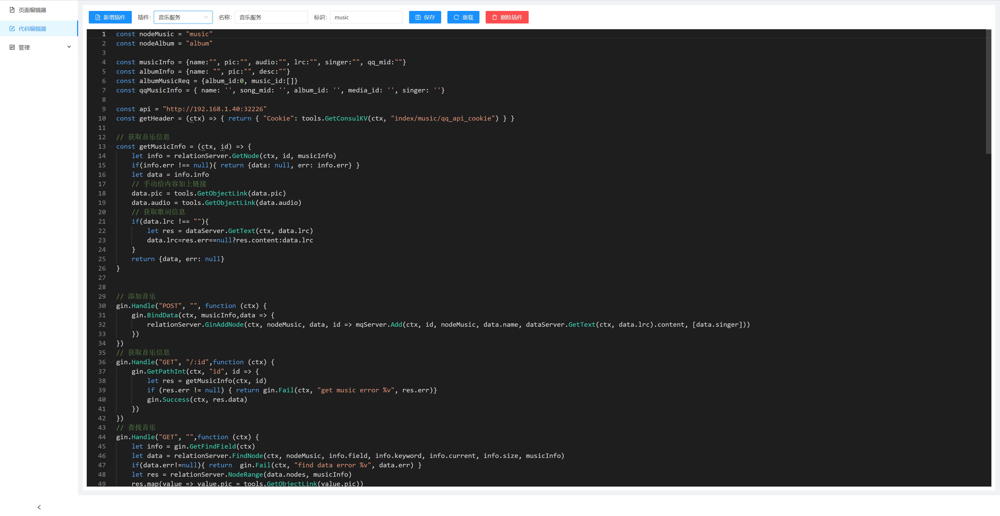
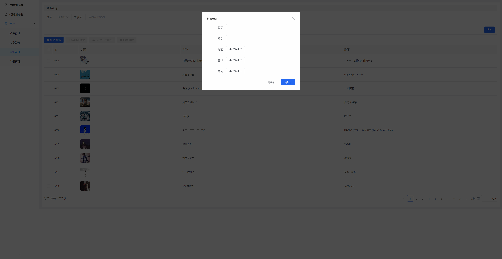

  
   
<h1 align="center">😍index</h1>
<h4 align="center">一款可扩展的资源管理软件</h4>

## 项目结构
- app 应用服务
- common 公共基础库
- data 存储服务
- file-front 网盘前端
- index-desktop-amis index桌面版
- index-front-amis index后台管理系统
- music-front 音乐播放器
- relation 关系服务
- search 搜索服务
- views 所有界面的json
- plugins 所有插件代码

## 功能特点
- 采用微服务架构
- 提供资源搜索功能，可以搜索所有资源
- 所有服务都采用插件来实现
- 前端低代码，可以使用JSON来配置前端

## 界面展示

